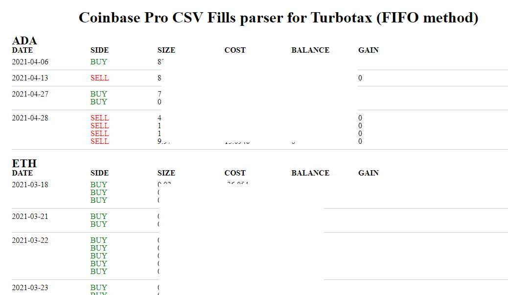

04/07

11:58 AM
Yuck... mixing logic and rendering together

Try it again

12:06 PM
Break

12:39 PM
Uebok gotta file these taxes

12:59 PM
Distracted, this is like those times back in the day I would be trying to do my physics homework and my brain would just not comply. Nope, sleep time.

The hard part about this is the looping/recursion and the decimal rounding. On CBP's side, things just magically equate... you expect 0.000001 left over from a sale but it's treated as 0 like wtf...

So what I'm working on has to have manual intervention where you check the balances in CBP activity and they match

It sucks

1:48 PM
FOCUS!!! You lazy pos lmao

I feel like I keep going in circles

I've written this process like 3-5x now I just keep changing directions, initially it was node based but then I moved it to client side/in browser only (no upload).

I think I've simplified it even more conceptually. You have your buy and sell groups sorted by currency > date.

Then as you process the sells, you have this pool that you have to match in size/cost basis based on the currency price at that time.

Then you keep the remainder in the buy set.

2:31 PM
back at it

2:47 PM
You are failing doctor

4:32 PM
Might be getting somewhere, numbers are making sense just slightly off

6:08 PM
Ooh... that was bad... I was going in a panic, checking the math on the side in excel sheet, I missed a digit in excel
so I thought my code was bad

6:43 PM
Ugh... this sucks infinite loop
I just noticed too the fills CSV I have doesn't match their portfolio activity eg. if there are 7 dates in the spreadsheet, I only see 5 in CBP... so idk.

For example I can't get these two to equal each other `0.001024 1e-8` I think that's `0.001024 0.00000008`

Good news is only BTC is the one that has problems.

I still have to manually verify this before considering it good enough for public use. I just have to move on.

There are over 1300 rows I have to validate oof.

A visual subtracting bar guide would be helpful. Then you can look at it visually to see if something doesn't make sense.

Well according to this and my other FIFO calculators I did have net gains in 2021 so that's cool except I gotta pay more taxes ha.

So I'll manually verify this CSV then damn.

04/06
Alright today is the day, really need to get this done/move on.

2:46 PM
Slow progress had to backtrack from what I had designed, went another direction.

3:03 PM
I'm failing, feel tired

Lucky for me the balances all start at 0 in 2021 since I wasn't using CBP till then.

4:38 PM
Ahh man... back to this, so now the UI looks like this

I have to do the computation again... generally it looks good but I am seeing some negative values later down which is not good (rounding problem).

5:13 PM
Distracted this is towards the end of the day when my mind starts to shit the bed

5:51 PM
Mad distracted, had to chase the sunlight real quick to test my solar cells project

04/05
I'm going to go build the client-based visual version.

I want to paint the buy/sell groups as expandable/interactive rows to correct the CSVs before producing them.

1:41 PM
Lucky for me I did not start using CBP until 2021. But in the future eg. 2022 I have to keep that in mind regarding coin held from 2021.

3:02 PM
I made hte original repo private as I accidentally uploaded my CSV file, it's not a huge deal, but still... I didn't intend to do that.

Also I decided to change how I'm going to do it. Have a new plan.

Food break