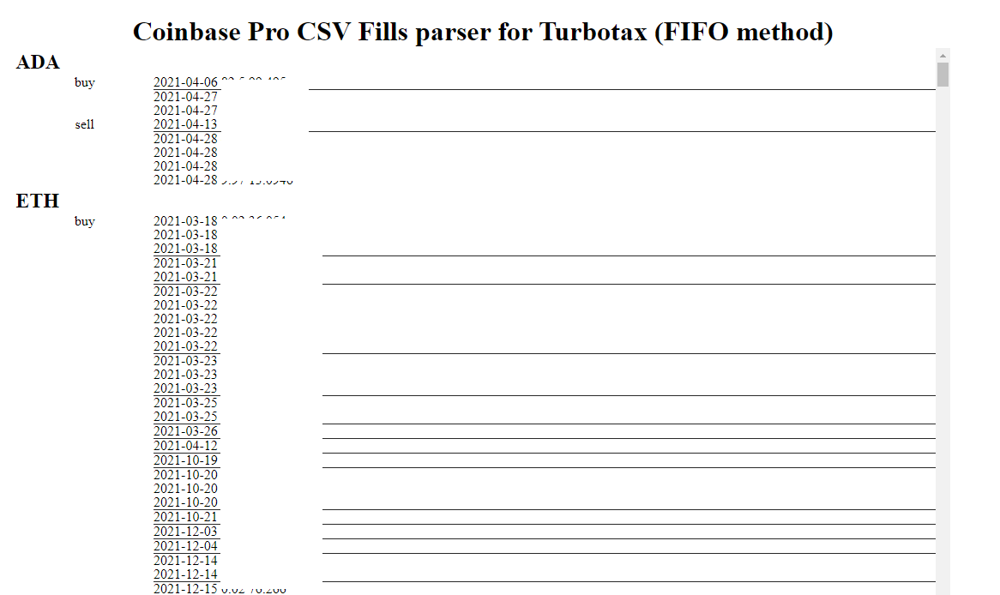

04/06
Alright today is the day, really need to get this done/move on.

1:23 PM
Getting distracted, need to wrap this up today

I decided to not try to round anything until needed. I had this thought that you could manually round where you think it should to get it to 0 by the UI.

I'll check on CBP how it handles subtraction with regard to decimal places.

It's really windy today and the power keeps periodically flickering turning off disabilng my internet temporarily ha.

2:25 PM
Man... progress is slow, I screwed up my sleep pattern again

I have not bothered with importing say Roboto for font styling yet, will come later.

I just need to get the main stuff down/get this damn tax return filed.

04/05
I'm going to go build the client-based visual version.

I want to paint the buy/sell groups as expandable/interactive rows to correct the CSVs before producing them.

1:41 PM
Lucky for me I did not start using CBP until 2021. But in the future eg. 2022 I have to keep that in mind regarding coin held from 2021.

3:02 PM
I made hte original repo private as I accidentally uploaded my CSV file, it's not a huge deal, but still... I didn't intend to do that.

Also I decided to change how I'm going to do it. Have a new plan.

Food break