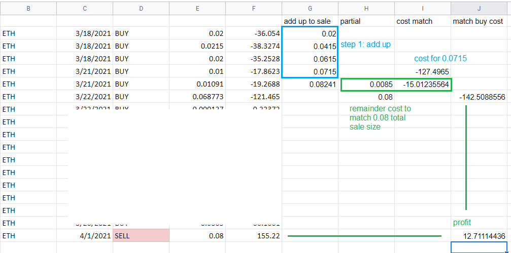

### Processing logic

Primarily this tool is intended for FIFO (first in first out) meaning when you sell some currency, the amount you bought first/oldest that matches the amount sold will be used to check if you have a profit or not.

If there is a remainder (buy row > sale size) or not enough (sale size > buy row), the next buy row is used, see the image below.

Column E is the size bought and column F is the cost for that amount based on the currency price at this point in time. If you divide F by E you'll get the full currency amount cost.