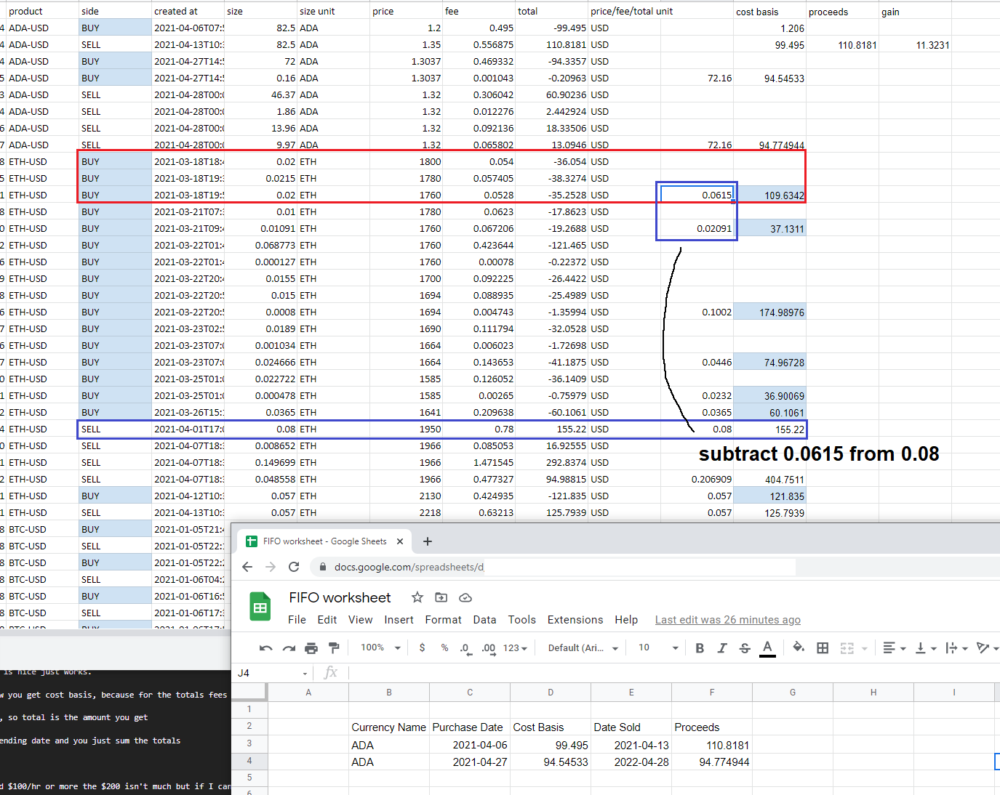

...

You can see in the image above how this process works.

* the buy groups are batched together (red square) by date
* sells are subtracted from the buys at that particular cost basis
* sales are similarly grouped by date

If a sale exceeds what a buy-date-group has, the next buy-date-group is used to fill in the remaining sale size. This means the varying cost-basis bought is factored into the profit eg. `proceeds - cost basis`.

To further iterate, the example above, the sale is `0.08` in size. The first buy-date-group i.e. `2021-03-18` has the combined size of `0.0615` that is less than the sale size of `0.08`. So you subtract `0.0615`from `0.08`. The remainder is subtracted from the next buy-date-group(s).

If you were to work out the above you'd have:

Buys at
* 03/18/2021, 0.0615, 109.6342 (cost basis $1782.67 for 1 ETH at this moment)
* 03/21/2021, 0.02091, 37.1311 (cost basis $1775.76 for 1 ETH)

Sell at
* 04/01/2021, 0.08, 155.22 (cost basis $1940.25 for 1 ETH)

So you would take the fractional cost of 0.0615 sold at the 04/01 date. Similarly do the remainder of 0.0185

The point is to arrive to a row like you see on the bottom-right corner. A buy-sell row capped by dates. Then you carry over any remaining buys fraction over to the next sold amount. With regard to the date I'm using the earliest buy date.

